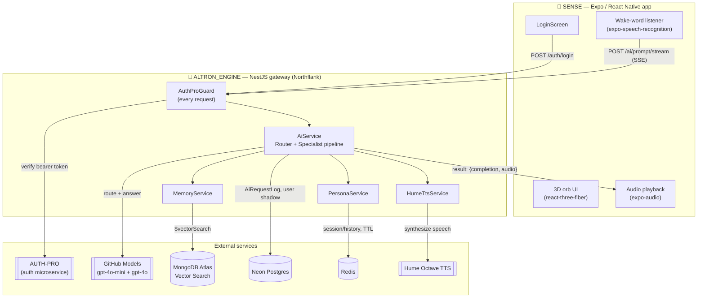
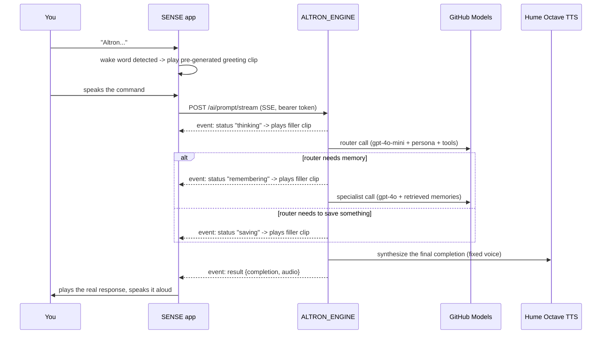

# AL-TRON

A personal, always-listening AI voice assistant. Say "Altron," ask it anything, and it answers out loud in its own synthesized voice — backed by a two-step router/specialist LLM pipeline, long-term memory via vector search, and short-term session state, all fronted by a mobile app with a live 3D reactive orb.

The repo is two independent projects that only talk to each other over HTTP:

| | |
|---|---|
| **[`ALTRON_ENGINE/`](ALTRON_ENGINE)** | NestJS API gateway — the "brain." Owns every LLM call, memory read/write, session state, and voice synthesis. |
| **[`SENSE/`](SENSE)** | Expo/React Native mobile app — the "face and ears." Wake-word detection, mic capture, 3D orb UI, audio playback. Holds no AI provider keys of its own. |

## Platform architecture



**Deployment topology:**
- `ALTRON_ENGINE` runs as a single Docker container on **Northflank**, built directly from its `Dockerfile` (no orchestration needed — Postgres/Mongo are already managed cloud services). The one stateful piece Northflank *does* host is a managed **Redis addon**, since that's the only dependency without an existing managed cloud provider in this stack.
- `SENSE` ships as a standalone Android APK — built either via **EAS Build** (cloud) or a local Gradle release build — with the deployed `ALTRON_ENGINE` URL baked in at build time. It has no server component of its own.
- AL-TRON never stores credentials directly: **AUTH-PRO** is the sole source of truth for sessions, and `ALTRON_ENGINE` just verifies tokens against it on every request, keeping a local "shadow" `User` row only so other tables (e.g. `AiRequestLog`) have something to foreign-key against.

### A voice request, end to end



This is why the gateway exposes a *streaming* endpoint at all: a full router → memory-search → specialist round trip can take several seconds, and the interim `status` events let the app narrate real progress in AL-TRON's own voice instead of sitting in silence.

## Quick start

You need both halves running to actually use the assistant. Each has its own full setup guide — this is the condensed path:

```bash
# 1. Backend
cd ALTRON_ENGINE
npm install
cp .env.example .env        # fill in DATABASE_URL, MONGO_DB_URL, AUTH_PRO_BASE_URL, GITHUB_PAT, HUME_API_KEY, REDIS_URL
npm run prisma:generate && npm run prisma:generate:mongo
npm run prisma:migrate      # or prisma:deploy against an existing DB
npm run prisma:push:mongo
npm run start:dev           # http://localhost:3000, docs at /docs

# 2. Mobile app (separate terminal)
cd SENSE
npm install
cp .env.example .env        # set EXPO_PUBLIC_BACKEND_URL to your machine's LAN IP, not localhost
npx expo run:android        # or: npx expo run:ios (macOS + Xcode) - builds a custom dev client, native modules don't run in plain Expo Go
```

Full details, every environment variable, and every npm script for each app are in the sections below.

---

# 🔧 ALTRON_ENGINE — Backend Gateway

The API gateway and "brain" of AL-TRON. A NestJS service that fronts a two-step **router + specialist** LLM pipeline, retrieves and writes long-term memory via vector search, keeps short-term session/persona state in Redis, and synthesizes spoken responses server-side so SENSE never has to talk to third-party AI APIs directly.

## How it works

1. A request hits `POST /ai/prompt` (or its streaming sibling, see below) with a plain `{ "prompt": "..." }` body.
2. A lightweight **router** model (`gpt-4o-mini` by default) sees the prompt plus AL-TRON's persona and two tools:
   - `query_historical_memory` — searches past logged context via MongoDB Atlas Vector Search.
   - `save_memory` — writes a new fact/event to that same memory log.
3. If the router calls `query_historical_memory`, the retrieved context is handed to a heavier **specialist** model (`gpt-4o` by default) for the real answer. If it calls `save_memory`, the write happens and a short confirmation is returned directly. Otherwise the router's own reply is returned as-is (cheaper and faster for anything that doesn't need personal history).
4. The final text is synthesized to speech server-side via **Hume Octave TTS** (a fixed preset voice) and returned as base64 MP3 alongside the text, so the app never needs its own TTS API key.
5. Short-term session history and mood/directives live in **Redis**, layered on top of the long-term persona defined in [`src/information/altron_profile.json`](ALTRON_ENGINE/src/information/altron_profile.json).

### `/ai/prompt` vs `/ai/prompt/stream`

- `POST /ai/prompt` — single JSON response once the whole pipeline finishes.
- `POST /ai/prompt/stream` — same pipeline, but streamed as Server-Sent Events so a client can narrate progress ("thinking" / "remembering" / "saving") before the final `result` event arrives. See [`ai.controller.ts`](ALTRON_ENGINE/src/modules/ai/ai.controller.ts) for the exact event shapes. This is what SENSE uses.

## Requirements

- **Node.js 20+** and npm (the Docker image is built on `node:20-bookworm-slim`)
- A **PostgreSQL** database (this project uses [Neon](https://neon.tech))
- A **MongoDB Atlas** cluster with a Vector Search index configured on the `memories` collection (plain self-hosted MongoDB won't support the `$vectorSearch` aggregation this project relies on)
- A **Redis** instance (a container is provided via `docker-compose.yml`, or run one locally, or a managed addon in production)
- Access to the following external services:
  - **AUTH-PRO** — the auth microservice this gateway delegates all session verification to (no local user/password storage here)
  - **GitHub Models** — a GitHub Personal Access Token with the `models: read` permission, used for both chat completions and embeddings
  - **Hume AI** — an API key for Octave TTS (server-side only)

## Environment variables

Copy `ALTRON_ENGINE/.env.example` to `ALTRON_ENGINE/.env` and fill in the values:

| Variable | Required | Notes |
|---|---|---|
| `NODE_ENV` | no (default `development`) | `development` \| `production` \| `test` |
| `PORT` | no (default `3000`) | HTTP port |
| `CORS_ORIGINS` | no | Comma-separated allowed origins |
| `DATABASE_URL` | **yes** | Postgres connection string (Prisma) |
| `MONGO_DB_URL` | **yes** | MongoDB Atlas connection string (memory layer) |
| `MEMORY_VECTOR_SEARCH_INDEX` | no (default `memory_vector_index`) | Atlas Vector Search index name |
| `AUTH_PRO_BASE_URL` | **yes** | Base URL of the AUTH-PRO service |
| `AUTH_PRO_TIMEOUT_MS` | no (default `5000`) | |
| `GITHUB_PAT` | **yes** | GitHub PAT used against GitHub Models |
| `GITHUB_MODELS_BASE_URL` | no | Default: `https://models.github.ai/inference` |
| `GITHUB_MODELS_DEFAULT_MODEL` | no | Default: `openai/gpt-4o-mini` |
| `GITHUB_MODELS_EMBEDDING_MODEL` | no | Default: `openai/text-embedding-3-small` |
| `GITHUB_MODELS_ROUTER_MODEL` | no | Default: `openai/gpt-4o-mini` |
| `GITHUB_MODELS_SPECIALIST_MODEL` | no | Default: `openai/gpt-4o` |
| `GITHUB_MODELS_TIMEOUT_MS` | no (default `30000`) | |
| `REDIS_URL` | **yes** | e.g. `redis://localhost:6379`, or a managed provider's connection string |
| `PERSONA_SESSION_TTL_SECONDS` | no (default `21600`, 6h) | Session idle expiry |
| `HUME_API_KEY` | **yes** | Octave TTS API key ([platform.hume.ai](https://platform.hume.ai/)) |
| `THROTTLE_DEFAULT_TTL_MS` / `THROTTLE_DEFAULT_LIMIT` | no | Global rate limit window/count |
| `THROTTLE_AI_TTL_MS` / `THROTTLE_AI_LIMIT` | no | Stricter rate limit for `/ai/*` |

All of these are enforced at boot by [`validation.schema.ts`](ALTRON_ENGINE/src/config/validation.schema.ts) — the app refuses to start if a required one is missing.

## Local setup

```bash
cd ALTRON_ENGINE

# 1. Install dependencies
npm install

# 2. Configure environment
cp .env.example .env
# then edit .env with real values

# 3. Generate BOTH Prisma clients (Postgres + Mongo are separate schemas)
npm run prisma:generate
npm run prisma:generate:mongo

# 4. Apply the Postgres schema
npm run prisma:migrate        # first time / new migrations, dev DB
# or
npm run prisma:deploy         # apply existing migrations, no new ones generated (prod-safe)

# 5. Push the Mongo schema (Mongo has no migration history, just a live schema push)
npm run prisma:push:mongo

# 6. Run it
npm run start:dev
```

The app boots at `http://localhost:3000`. Swagger API docs are available at `http://localhost:3000/docs` (auto-disabled when `NODE_ENV=production`). A liveness probe lives at `GET /health` (no auth, no rate limit).

## npm scripts

| Script | Purpose |
|---|---|
| `npm run start` | Start once, no watch |
| `npm run start:dev` | Start with hot reload (normal dev loop) |
| `npm run start:debug` | Start with `--inspect` + hot reload |
| `npm run start:prod` | Run the compiled `dist/main.js` (what the Docker image runs) |
| `npm run build` | Compile TypeScript via `nest build` |
| `npm run lint` | ESLint with `--fix` |
| `npm run format` | Prettier over `src/**/*.ts` |
| `npm run test` / `test:watch` / `test:e2e` | Jest |
| `npm run prisma:generate` | Generate the Postgres Prisma client |
| `npm run prisma:generate:mongo` | Generate the Mongo Prisma client (into `generated/mongo-client`) |
| `npm run prisma:migrate` | Create + apply a Postgres migration (dev) |
| `npm run prisma:deploy` | Apply existing Postgres migrations (prod-safe, no prompts) |
| `npm run prisma:studio` / `prisma:studio:mongo` | Prisma Studio for each datasource |
| `npm run prisma:push:mongo` | Push the Mongo schema without a migration history |

## API overview

All routes except `/auth/*`, `/admin/*`, and `/health` require `Authorization: Bearer <AUTH-PRO token>` — this gateway never issues or verifies tokens itself, it delegates to AUTH-PRO's `GET /users/me` on every request (see [`auth-pro.guard.ts`](ALTRON_ENGINE/src/common/guards/auth-pro.guard.ts)), and upserts a local "shadow" `User` row on every successful check so other tables can safely foreign-key against it.

| Method | Path | Auth | Purpose |
|---|---|---|---|
| POST | `/ai/prompt` | Bearer | Router + specialist pipeline, single JSON response |
| POST | `/ai/prompt/stream` | Bearer | Same pipeline, SSE progress events + final result |
| POST | `/memory/log` | Bearer | Manually log a memory entry |
| POST | `/memory/search` | Bearer | Vector-search the memory log |
| GET | `/users/me` | Bearer | Current user profile |
| PATCH | `/users/me` | Bearer | Update current user profile |
| POST | `/users/avatar` | Bearer | Upload avatar |
| POST | `/auth/signup` | Public | Proxied to AUTH-PRO |
| POST | `/auth/login` | Public | Proxied to AUTH-PRO |
| POST | `/auth/forgot-password` | Public | Proxied to AUTH-PRO |
| POST | `/auth/update-password` | Public | Proxied to AUTH-PRO |
| POST | `/admin/users/ban` | Public + `adminPass` in body | Ban a user |
| POST | `/admin/mail/send-custom` | Public + `adminPass` in body | Send a custom email |
| GET | `/health` | Public | Liveness probe, `{ status, uptime }` |

Full request/response schemas are in Swagger at `/docs`.

## Dev-only scripts

[`scripts/generate-filler-audio.js`](ALTRON_ENGINE/scripts/generate-filler-audio.js) — one-off script that pre-synthesizes AL-TRON's spoken filler phrases ("thinking" / "remembering" / "saving") and wake-word greeting acknowledgments through Hume Octave TTS (same fixed voice as real responses), writing the MP3s straight into `SENSE/assets/audio/`. These are bundled as static assets in the app, not synthesized per-request. Run it again whenever the wording changes:

```bash
cd ALTRON_ENGINE
node scripts/generate-filler-audio.js   # requires HUME_API_KEY in .env
```

## Project structure

```
ALTRON_ENGINE/
  src/
    common/          Guards, interceptors, filters, decorators shared app-wide
    config/          Env var loading (configuration.ts) + Joi validation schema
    information/     altron_profile.json - AL-TRON's persona/user profile data
    modules/
      admin/         User ban / custom email, proxied to AUTH-PRO
      ai/            Router + specialist pipeline, /ai/prompt(/stream)
      auth/          Signup/login/password, proxied to AUTH-PRO
      health/        Liveness probe
      hume/          Server-side Hume Octave TTS client
      memory/        Vector-search memory log (MongoDB Atlas)
      persona/       Redis-backed short-term session/history state
      users/         Current-user profile + avatar (also upserts the local shadow row)
    prisma/          Postgres PrismaService (users, ai_request_logs)
    redis/           ioredis wrapper (RedisService)
    utils/           Shared helpers (error normalization, response envelope)
  prisma/
    schema.prisma        Postgres schema
    mongo/schema.prisma  MongoDB schema (separate datasource, own generated client)
  scripts/
    generate-filler-audio.js   One-off Hume TTS pre-generation (see above)
  Dockerfile, docker-compose.yml, .dockerignore   See Deployment, below
```

---

# 📱 SENSE — Mobile App

The mobile client for AL-TRON — an always-listening voice assistant built with Expo/React Native. Says "Altron" (or "Ultron"/"Jarvis" — see below) to wake it, speak your request, and it answers out loud in AL-TRON's own synthesized voice, with a live 3D animated orb reacting to mic input and conversation state.

SENSE holds no AI provider keys itself — every LLM call and voice synthesis happens server-side in ALTRON_ENGINE, which this app talks to over a single HTTP(S) connection.

## Features

- **Real login** — a `LoginScreen` calls ALTRON_ENGINE's `POST /auth/login` (itself a thin proxy to AUTH-PRO) and keeps the resulting token in `expo-secure-store`, not baked into the JS bundle. The mic doesn't start listening until you're logged in, and a 401 from the gateway (expired/revoked token) automatically drops you back to the login screen instead of looping on a dead token.
- **Wake word detection** — continuous on-device speech recognition (`expo-speech-recognition`) listens for "Altron". Also accepts "Ultron" and "Jarvis", since on-device recognizers consistently mishear the invented word as the much more common Marvel names.
- **Streaming responses** — prompts are sent to `POST /ai/prompt/stream` (Server-Sent Events over `expo/fetch`, which — unlike React Native's built-in `fetch` — exposes a real, incrementally-readable response body). Interim "thinking / remembering / saving" status events play a matching pre-generated voice clip instead of sitting in silence.
- **AL-TRON's actual voice** — the final answer's audio (and the wake-word greetings / status fillers) are all pre/server-synthesized via Hume Octave TTS with a fixed voice, not the OS's generic TTS. The device voice (`expo-speech`) is only a fallback if the backend omits audio.
- **3D animated orb** (`components/AltronOrb3D.tsx`) — `@react-three/fiber` + custom GLSL shaders (fresnel glow, noise displacement), audio-reactive to mic input, with distinct idle/listening/thinking/speaking/disconnected states.
- **Barge-in** — you can say "Altron" again mid-response to interrupt it and start a new command immediately.

## Requirements

- **Node.js 20+** and npm
- **ALTRON_ENGINE** running and reachable from your device/emulator (see above)
- A way to build a **custom dev client** — this app uses native modules (`expo-speech-recognition`, `expo-gl`, `expo-audio`, `expo-secure-store`, `three`) that do **not** run in the plain Expo Go app, so you need:
  - **Android**: Android Studio + an emulator or a physical device with USB debugging, for `expo run:android`
  - **iOS**: a Mac with Xcode, for `expo run:ios`
- A **physical device is strongly recommended** for real use — wake-word detection and the mic need an actual microphone; simulators/emulators are fine for UI work but awkward for voice testing.

> **This project pins Expo SDK 57.** Its APIs (especially `expo/fetch`, `expo-audio`, `expo-file-system`'s `File`/`Paths`) have changed across recent SDKs — see [`SENSE/AGENTS.md`](SENSE/AGENTS.md) and check the versioned docs at https://docs.expo.dev/versions/v57.0.0/ before assuming an API from memory or an older tutorial still applies.

## Environment variables

Copy `SENSE/.env.example` to `SENSE/.env`:

| Variable | Notes |
|---|---|
| `EXPO_PUBLIC_BACKEND_URL` | ALTRON_ENGINE's `/ai/prompt` URL, e.g. `http://192.168.1.19:3000/ai/prompt` for local dev (your machine's **LAN IP**, not `localhost` — a physical/emulated device can't reach your dev machine's loopback address), or the deployed HTTPS URL for a distributable build. Both the `/stream` variant and the base URL used for `/auth/login` are derived from this automatically. |

`EXPO_PUBLIC_*` vars are inlined into the JS bundle **at build/Metro-start time**, not read live — editing `.env` requires a full restart of `npx expo start` (not just an in-app reload) to take effect for dev-client builds, and EAS/local release builds bake in whatever `.env` held at build time. Never put a real secret behind that prefix; this is also why the Hume API key lives only in ALTRON_ENGINE's `.env`, and why the auth token isn't an env var at all — it's obtained via real login and kept in SecureStore (see Architecture notes, below).

## Setup

```bash
cd SENSE

# 1. Install dependencies
npm install

# 2. Configure environment
cp .env.example .env
# then edit .env - set EXPO_PUBLIC_BACKEND_URL to your machine's LAN IP

# 3. Make sure ALTRON_ENGINE is running and reachable at that address

# 4. Build + install a custom dev client and launch it
npx expo run:android      # or: npx expo run:ios (macOS + Xcode only)
```

After the first native build, day-to-day iteration is just:

```bash
npx expo start
```

with the dev client already installed on the device — no need to rebuild natively again unless you add/change a native module or `app.json` config.

## npm scripts

| Script | Purpose |
|---|---|
| `npm run start` | Start the Metro bundler (`expo start`) |
| `npm run android` | Build + install the native dev client and run on Android (`expo run:android`) |
| `npm run ios` | Build + install the native dev client and run on iOS (`expo run:ios`) |
| `npm run web` | Run in a browser (`expo start --web`) — the 3D orb and native voice/speech modules won't work here, useful for quick UI-only checks only |

## Permissions

Declared in `app.json` and requested at runtime on first launch:

- **Microphone** — to hear the wake word and your commands
- **Speech recognition** — on-device transcription (iOS: `NSSpeechRecognitionUsageDescription`; Android: bundled with `RECORD_AUDIO`)

## Project structure

```
SENSE/
  App.tsx                    Entire app: state machine, mic/wake-word loop,
                              SSE streaming client, TTS playback, render
  components/
    AltronOrb3D.tsx           The active 3D orb (react-three-fiber + GLSL)
    AltronOrb.tsx              Older 2D/SVG orb, unused - kept for reference
    LoginScreen.tsx            Email/password form -> POST /auth/login
  services/
    auth.ts                    SecureStore wrapper for the AUTH-PRO token
    hume/base64.ts             base64 -> Uint8Array decode (no atob/Buffer dep),
                                used to write backend-synthesized MP3s to disk
  assets/
    audio/                     Pre-generated Hume voice clips: thinking/
                                remembering/saving fillers + wake-word greetings
                                (see ALTRON_ENGINE/scripts/generate-filler-audio.js)
  eas.json                    EAS Build profiles - see Deployment, below
```

## Architecture notes

- **Auth**: `LoginScreen` posts straight to ALTRON_ENGINE's `POST /auth/login` (a public route that itself just proxies to AUTH-PRO) and stores the returned `accessToken` in `expo-secure-store` via `services/auth.ts`. You need an existing AUTH-PRO account to log in — this app has no signup screen, only login. The mic effect in `App.tsx` doesn't run at all until a token is present, and any 401 from `/ai/prompt/stream` clears the stored token and drops back to `LoginScreen` automatically.
- **Why SSE instead of a plain request/response**: a single `/ai/prompt` call can take several seconds (router call, sometimes a memory search + specialist call on top). `/ai/prompt/stream` lets the backend push "thinking" / "remembering" / "saving" events as the pipeline actually progresses, and the app plays a matching pre-generated voice clip for each one instead of leaving the user in silence.
- **Two separate audio players**: `ttsPlayer` (the real response) and `clipPlayer` (wake-word greetings + status fillers) are kept apart on purpose — sharing one player would mean a short filler clip finishing playback could trigger the "response finished" handler and snap the UI back to standby mid-request.
- **Continuous listening, restart-based capture**: `expo-speech-recognition` resets its transcript on natural pauses, so rather than trying to slice the wake word out of a running transcript, the app stops and restarts a dedicated fresh recognition session the moment "Altron" is heard, and captures whatever comes next as the full command.

---

# 🚀 Deployment

## ALTRON_ENGINE on Docker

Postgres (Neon) and MongoDB (Atlas) are cloud-hosted for this project, so Docker only needs to run the app itself plus Redis (the one dependency that isn't already a managed cloud service).

**Requirements:** Docker Engine with Compose v2 (`docker compose`, not the old standalone `docker-compose`).

```bash
cd ALTRON_ENGINE

# Build the image and start app + redis
docker compose up -d --build

# Tail logs
docker compose logs -f app

# Check it's alive
curl http://localhost:3000/health

# Stop (add -v to also drop the redis-data volume)
docker compose down
```

`docker-compose.yml` loads the rest of your `.env` as-is (Neon/Atlas/AUTH-PRO/GitHub PAT/Hume key all pass through unchanged) and only overrides `REDIS_URL` to point at the `redis` service name instead of `localhost`, since `localhost` inside the app container would mean the container itself.

**Plain `docker build` / `docker run` (no Compose):**

```bash
docker build -t altron-engine ALTRON_ENGINE

docker run -d --name altron-engine \
  --env-file ALTRON_ENGINE/.env \
  -e REDIS_URL=redis://<your-redis-host>:6379 \
  -p 3000:3000 \
  altron-engine
```

Notes on the image itself:
- 2-stage build ([`Dockerfile`](ALTRON_ENGINE/Dockerfile)): the builder stage installs devDependencies, generates both Prisma clients, compiles TypeScript, then prunes devDependencies; the runtime stage copies over only the pruned `node_modules`, `dist`, the generated Prisma clients, and `src/information/altron_profile.json` (read off disk at runtime), and runs as the non-root `node` user.
- Deliberately does **not** include the `prisma` CLI — run migrations from a dev machine or CI against `DATABASE_URL`/`MONGO_DB_URL` directly (`npm run prisma:deploy`, `npm run prisma:push:mongo`), not from inside the container.
- Has a built-in `HEALTHCHECK` against `GET /health`.

## ALTRON_ENGINE on Northflank (cloud)

This project deploys as a **Dockerfile-based service** in a monorepo, which needs two fields set correctly:

- **Build context**: `ALTRON_ENGINE` (relative to the repo root — **no leading slash**; a leading `/` gets treated as an absolute path on the build worker's filesystem, where it doesn't exist, silently producing an empty build context)
- **Dockerfile location**: `Dockerfile` (relative to that context, so it resolves to `ALTRON_ENGINE/Dockerfile`)

Redis has no existing managed provider in this stack (unlike Postgres/Mongo), so it's provisioned as a **Northflank Redis addon**:
1. Addons → Create addon → Redis.
2. Copy its **internal** connection string (`REDIS_MASTER_URL` — starts `rediss://...`, TLS; `ioredis` picks up TLS automatically from the `rediss://` scheme) rather than the external one, since the app service and the addon live in the same project.
3. Set that as the `ALTRON_ENGINE` service's `REDIS_URL` environment variable (overriding the `localhost` value from `.env`), then redeploy.

Set every other required variable from the Environment variables table above as service env vars or via a linked secret group. Watch the deploy logs for `Connected to Redis` and `Nest application successfully started` — a Redis misconfiguration is the most common cause of a crash loop here (ioredis treats a failed connection as fatal to boot, unlike the graceful degradation `HumeTtsService` has for a Hume outage).

## SENSE — building a release APK

The mobile app has no server to deploy — "deployment" here means producing a release APK with the **deployed** `ALTRON_ENGINE` URL baked in (a distributed APK can't reach a dev machine's LAN IP).

**Option A — EAS Build (cloud):**

```bash
cd SENSE
eas env:create --name EXPO_PUBLIC_BACKEND_URL --value "https://<your-deployed-url>/ai/prompt" --environment preview --visibility plaintext
eas env:create --name EXPO_PUBLIC_BACKEND_URL --value "https://<your-deployed-url>/ai/prompt" --environment production --visibility plaintext
eas build --platform android --profile production
```

`eas.json`'s `production`/`preview` profiles build an `.apk` (not the Play-Store-default `.aab`) and pull env vars from the EAS-hosted `environment` named in each profile. This matters because **EAS Build never reads your local `.env`** — cloud builds only see variables explicitly pushed via `eas env:create`; a local `.env` value has no effect on a cloud build at all.

**Option B — local Gradle build (no cloud, no EAS quota):**

```bash
cd SENSE
# Point .env at your deployed backend first - a local release build DOES
# read the local .env, unlike an EAS cloud build.
# EXPO_PUBLIC_BACKEND_URL=https://<your-deployed-url>/ai/prompt

cd android
./gradlew assembleRelease
# -> android/app/build/outputs/apk/release/app-release.apk
```

This variant is signed with the local debug keystore (fine for direct/sideload install and testing; not eligible for Play Store submission without configuring a real release keystore). Install directly with `adb install -r app-release.apk`.
